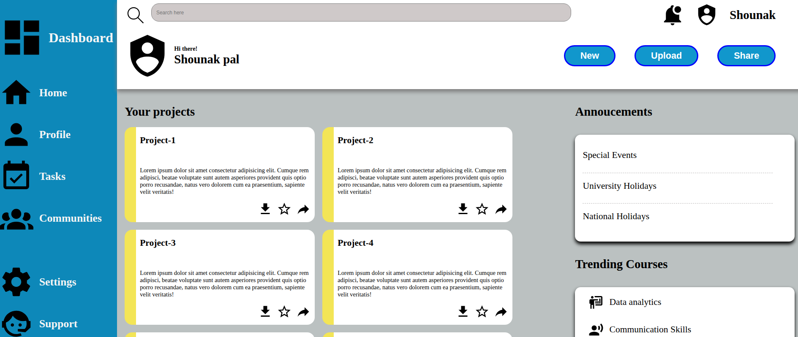

# 🧭 Dashboard UI – Admin Panel Interface

A clean and modern **Dashboard UI** layout designed using **HTML** and **CSS Grid** – ideal for admin panels, task management, or internal tools.

---

## 🚀 Project Overview

This is a dashboard interface showcasing a sidebar navigation, header with user utilities, and a main section displaying projects, announcements, and trending topics.

Designed as a beginner-to-intermediate level frontend layout for learning **CSS Grid** and layout structuring.

---

## 🛠️ Tech Stack

- 🧱 HTML5  
- 🎨 CSS3 (CSS Grid & Flexbox)  
- 🖼️ SVG icons (Material Design)  

---

## 🎯 Features

- 📌 Sidebar navigation with icons + labels  
- 🔍 Header section with search, notification, and user info  
- 🧩 Project cards (2x3 grid) with color indicators  
- 📢 Announcements section styled like a notification panel  
- 📈 Trending section mimicking a social feed  
- 💡 Clean and structured code

---

## 📸 Screenshots

| Dashboard View |
|----------------|
|  |

---

## 📬 Contact
👤 Author: Shounak Pal

📧 Email: shounakpal.work@gmail.com

